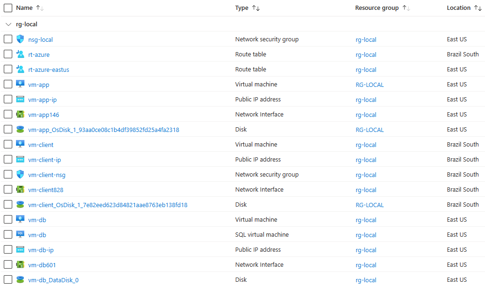

# Evento Semana Arquiteto Azure

Documentação das atividades realizadas na execução do laboratório prático do evento **Semana Arquiteto Azure** promovido pela **TFTEC Cloud**.

## Objetivos do Projeto SAA

- Realizar a migração das Aplicações da TFTEC Cloud para o Azure
- Escopo técnico:
  - Configuração de um Modelo de Nuvem Híbrida: Azure e On-premises
  - Definição de conectividade ligando a rede local com o ambiente do Azure
- Avaliações para estabelecer critério técnico e financeiro para estratégia de migração

## Etapas de Migração para Nuvem

- Fazer o Inventário do Ambiente (Azure Migrate)
- Definir a Estratégia de Migração
- Desenhos arquiteturais (atual/ proposta para migração)
- Estimativa de Precificação
- Avaliação CPSDM
- Padrões de Taxonomia

### Arquitetura Local (atual) - On Premises

- Servidor com duas Aplicações: Sistema de Lçto de Despesas; Dashboard de apresentação de informações
- Servidor de Database sendo acessado pelas duas aplicações

**Diagrama da Arquitetura Local:**

### Arquitetura proposta para Migração - Azure e Local

**Diagrama da Arquitetura Híbrida:**

- VPN S2S: conexão do Azure com On Premises
  - Azure: VPN Gateway
  - Local: Firewall
- Migração do Sistema de Lçto de Despesas: Azure App Service
- Migração do DB: Azure SQL Database

### Precificação do Projeto

- Precificação estimada baseada na Arquitetura proposta para migração
- Ferramenta **Azure Pricing Calculator**: <https://azure.microsoft.com/en-us/pricing/calculator/>

**Estimativa de Preço para o Projeto:**

### Metodologia CPSDM

Fatores:

- **C**usto: peso 2
- **P**erformance: peso 1,5
- **S**eguro: peso 1,5
- **D**isponível: peso 1
- **M**oderno: peso 1

Pontuações:

- 1: Não aderente
- 2: Parcialmente aderente
- 3: Totalmente aderente

Resultados:

- 21 - 15: recurso altamente adequado às necessidades do Cliente
- 14 - 12: recurso moderadamente adequado às necessidades do Cliente
- 07 - 12: recurso não recomendado às necessidades do Cliente

**Resultados da avaliação CPSDM realizada para o Projeto:**

### Padrões de Taxonomia

Padrões de nomenclatura para os recursos do Azure utilizados no Projeto.

| Recurso  | Ex. Taxonomia | Descrição |
| -------- | :-----------: | ---------: |
| Resource Group | rg-prd-prj | rg - recurso |
|                |            | prd - ambiente |
|                |            | prj - projeto |
| Virtual Machine | vm-ad-prd-eastus | vm - recurso |
|                 |                  | ad - workload |
|                 |                  | prd - ambiente |
|                 |                  | eastus - região |
| Virtual Network | vnet-prd-eastus-001 | vnet - recurso |
|                 |                     | prd - ambiente |
|                 |                     | eastus - região |
| Subnet | snet-prd-eastus-001 | snet - recurso |
|        |                     | prd - ambiente |
|        |                     | eastus - região |
| Network Security Group | nsg-prd-eastus-001 | nsg - recurso |
|                        |                    | prd - ambiente |
|                        |                    | eastus - região |
| Public IP | pip-vm-prd-eastus-001 | pip - recurso |
|           |                       | vm - recurso associado |
|           |                       | prd - ambiente |
|           |                       | eastus - região |
| Application Gateway | agw-prd-uks-001 | agw - recurso |
|                     |                 | prd - ambiente |
|                     |                 | uks - região |

## Ambiente Local: detalhes de execução do Projeto

O ambiente Local (On-premises) será representado dentro do próprio Azure, simulando o que seria o ambiente local das aplicações.

### Simulação do ambiente Local criado no Azure

- Resource Group: **rg-local**
- Virtual Network: **vnet-local**
  - CIDR: 10.0.0.0/16
  - Subnet **sub-app**: 10.0.1.0/24
  - Subnet **sub-db**: 10.0.2.0/24
- Virtual Machines:
  - **vm-app**: Windows Server 2022 Datacenter Azure Edition
  - **vm-db**: SQL Server 2022 on Windows Server 2022
- Network security group: **nsg-local**
  - Inbound security rules - allow: 3389, 80, 8080

### Simulação do Firewall para conectividade da VPN S2S entre Local e Azure

#### Criação de VM para ser o Firewall/Roteador (NVA - Network Virtual Appliance)

- Virtual Network: **vnet-local-fw**
  - CIDR: 10.1.0.0/16
  - Subnet **sub-fw**: 10.1.1.0/24
- Virtual Machine (firewall): **vm-fw**
- Image: Windows Server 2022 Datacenter Azure Edition
- Size: Standard B2s
- Username: [my_user]
- Password: [my_password]
- Virtual Network: vnet-local-fw
- Subnet: sub-fw
- NIC nsg: Basic (ambiente local: NSG direto na placa de rede)
  - Ports: 3389

#### Realizar configurações de roteamento na VM (encaminhamento de tráfego)

**Obs.:** realizar essas configurações após criar recursos do Azure definidos no tópico "Recursos Básicos" mais abaixo.

Configurações no lado do Ambiente Local:

- Virtual Machines > "vm-fw" > Networking settings > clicar em Network interface (NIC)
  - NIC > IP configurations > IP Settings > **Enable IP forwarding**: habilitar

- Conectar na "vm-fw" via RDP (configurar RRAS - Role Remote Access Server - roteamento)
  - Server Manager > Manage > Add Roles and Features
    - Server Roles - **Remote Access**: habilitar
    - Remote Access > Role Services
      - **DirectAccess and VPN (RAS)**: habilitar
      - **Routing**: habilitar
    - [Install]
  - Configuração: clicar na notificação no topo direito > Open the Getting Started Wizard (irá carregar janela de configuraçaõ do RAS)
    - Deploy VPN only > botão dir. "vm-fw" > Configure and Enable RAS (criação da Network Interface com Azure)
      - Configuration - selecionar **Secure connection between two private networks**
      - Demand-Dial Interface Wizard
        - Interface name: **VPN-AZURE**
        - Connection Type: VPN
        - VPN Type: IKEv2
        - Destination Address: [IP_VirtualNetworkGateway_Azure]
    - "vm-fw" > IPv4 > Static Routes > botão dir. > New Static Route (configuração de Static Rote p/ rede no AZure)
      - Interface: VPN-AZURE
      - Destination: [192.168.0.0] (IP da VNet criada no ambiente do Azure)
      - Mask: 255.255.0.0
    - "vm-fw" > Network Interfaces > "VPN-AZURE" > botão dir. > Properties
      - Options:
        - Connection type: selecionar "Persistent connection"
        - Dialing policy > Redial attempts: 3
      - Security (definição de uma chave compartilhada para conexão):
        - Authentication > selecionar "Use preshared key": [definir_uma_chave_compartilhada]

Configurações no lado do Ambiente Azure:

- Local Network Gateway > create (representação no Azure do ambiente Local)
  - Name: **lng-prd-uks-001**
  - Endpoint: IP address
  - IP address: [191.232.171.229] [IP da "vm-fw" - firewall do ambiente local]
  - Address Space(s): (Endereço das redes do ambiente local)
    - 10.0.0.0/16 (vnet-local)
    - 10.1.0.0/16 (vnet-local-fw)

- Virtual Network Gateway > "vng-prd-uks-001" > Settings > Connections > + Add (configuração da Connection entre VNG e LNG)
  - Connection type: Site-to-Site (IPSec)
  - Name: **vpn-azure**
  - Virtual network gateway (VNG): vng-prd-uks-001
  - Local network gateway (LNG): lng-prd-uks-001
  - IKE Protocol: IKEv2

- Connections > "vpn-azure" > Authentication (configurar "Chave Compartilhada" do ambiente Local no Azure)
  - Shared key (PSK): [chave_compartilhada_definida]
  - [Save]

Nesse ponto, a VPN está conectando os dois ambiente, o que precisa agora é definir o Roteamento para que os demais recursos também consigam se comunicar pela VPN.

- Route Tables > Create
  - Resource group: rg-local
  - Name: **rt-azure**
- Route Tables > "rt-azure" > Routes > + Add
  - Route name: **route-firewall**
  - Destination type: IP Address
  - Destination IP: 192.168.0.0/16 (Endereço da VNet do ambiente do Azure)
  - Next hop type: Virtual appliance
  - Next hop address: 10.1.1.4 (IP da "vm-fw" - firewall)
- Route Tables > "rt-azure" > Subnets > + Associate
  - VNet: vnet-local-fw
  - Subnet: sub-fw

- Route Tables > Create
  - Resource group: rg-local
  - Name: **rt-azure-eastus**
- Route Tables > "rt-azure-eastus" > Routes > + Add
  - Route name: **route-firewall**
  - Destination type: IP Address
  - Destination IP: 192.168.0.0/16 (Endereço da VNet do ambiente do Azure)
  - Next hop type: Virtual appliance
  - Next hop address: 10.1.1.4 (IP da "vm-fw" - firewall)
- Route Tables > "rt-azure-eastus" > Subnets > + Associate
  - VNet: vnet-local
  - Subnet: sub-app
- Route Tables > "rt-azure-eastus" > Subnets > + Associate
  - VNet: vnet-local
  - Subnet: sub-db

### Peering entre VNets "vnet-local" e "vnet-local-fw"

Obs.: a separação em duas VNets para simulação do ambiente Local (On-premises) foi para criação das VMs em Regiões diferentes, possibilitando assim, a realização do laboratório utilizando uma contra "Free Tier".

- Virtual Network > "vnet-local" > Settings - Peerings > + Add:
  - This VNet - Peering link name: **local-to-local-fw**
  - Allow 'vnet-local' to access 'vnet-local-fw': habilitado
  - Allow 'vnet-local' to receive forwarded traffic from 'vnet-local-fw': habilitado
  - Remote Vnet - Peering link name: **local-fw-to-local**
  - Virtual network: vnet-local-fw
  - Allow 'vnet-local-fw' to access 'vnet-local': habilitado
  - Allow 'vnet-local-fw' to receive forwarded traffic from 'vnet-local': habilitado

### Simulação de um "Client" para teste de conectividade nas Aplicações/rede/Azure

- Virtual Machine: **vm-client**
- Image: Windows 11 Pro
- Size: Standard B2s
- Username: [my_user]
- Password: [my_password]
- Virtual Network: vnet-local-fw
- Subnet: sub-fw
- NIC nsg: Basic (ambiente local: NSG direto na placa de rede)
  - Ports: 3389

**Obs.:** acessar as VMs e desabilitar o firewall para realizar os testes de conectividade entre ambientes

## Ambiente Azure: detalhes de execução do Projeto

### Recursos Básicos

- Resource Group: **rg-prd-saa**
- Virtual Network: **vnet-prd-uks-001**
  - CIDR: 192.168.0.0/16
  - Subnet **snet-prd-uks-001**: 192.168.1.0/24
- VNet > Subnet > + Gateway subnet:
  - **GatewaySubnet**: 192.168.2.0/24
- Network Security Group:
  - **nsg-prd-uks-001**
  - Subnets > + Associate: snet-prd-uks-001
- Virtual Network Gateway:
  - **vng-prd-uks-001**
  - Gateway type: VPN
  - SKU: VpnGw1
  - VNet: vnet-prd-uks-001 (deve carregar a Subnet "GatewaySubnet")
  - Public IP > new: **pip-vng-prd-uks-001**
  - Enable active-active mode: Disable

### Criação de uma VM para testes de conectividade no ambiente

- Resource group: rg-prd-saa
- **vm-tmp-dev**
- Image: Windows Server 2022 Datacenter Azure Edition
- Size: Standard B2s
- Username: [my_user]
- Password: [my_password]
- Virtual Network: vnet-prd-uks-001
- Subnet: snet-prd-uks-001
- NIC nsg: None (irá usar o NSG da Subnet)

**Habilitar conexão RDP com a VM no NSG:**

- Network Security Group > "nsg-prd-uks-001"
  - Inbound security rules > + Add:
    - Source: Any
    - Destination: IP Addresses [192.168.1.4]
    - Service: RDP
    - Allow
    - Priority: 300

**Obs.:** acessar a VM e desabilitar o firewall para realizar os testes de conectividade entre ambientes

## Migração da Aplicação na VM para um App Service

### Projeto do Azure Migrate

- Azure Migrate > Create project
  - Project: **prj-saa**
  - Geography: US

### Azure App Service Plans

- App Service Plans > Create
  - Name: **asp-sis-uks-001**
  - OS: Windows
  - Pricing Plan: Standard S1

### Executar o processo de migração na VM para o App Services

- Conectar na "vm-app" e Instalar o Assistente de Migração do App Service para .NET
  - baixar/instalar assistente: <https://appmigration.microsoft.com/api/download/windows/AppServiceMigrationAssistant.msi>
  - Abrir o App Service Migration Assistant
    - Executar o "Assessment Report" para o web site desejado
    - Azure Migrate Hub: projeto do Azure Migrate criado anteriormente no portal do Azure - "prj-saa"
    - Destination Site Name: **app-saa** [unique-site-name]
    - App Service Plan > Use existing: criado anteriormente no portal do Azure - "asp-sis-uks-001"
    - [Migrate]

### Ajustes de Conectividade do App Service com a Database na "vm-db"

- Virtual Network > "vnet-prd-uks-001" > Subnets > + Subnet (Subnet exclusiva para VNet Integration do App Service)
  - Name: **snet-int-uks-001**
  - Subnet address range: 192.168.3.0/24

- App Service > "app-saa" > Networking > Outbound traffic > VNet integration > clicar em "Not configured"
  - Add VNet integration
  - VNet: "vnet-prd-uks-001"
  - Subnet: "snet-int-uks-001"

## Migração do SQL Server na VM para o Azure SQL Database

### Executar o processo de migração na VM de dados para o SQL Database

- SQL databases > Create
  - Database name: **saa-database** (utilizar mesmo nome do DB no SQL Server na VM)
  - Server > Create new:
    - Server name: **srv-saadb-prd-uks-001**
    - Authentication: Use SQL Authentication
    - Server admin login: [my_username] (usar mesmo usuário do SQL Server na VM)
    - Password: [my_password] (usar mesmo password do SQL Server na VM)
  - Workload environment: Production
  - Compute + storage > Configure database:
    - Service tier: DTU-based - Standard
    - [Definir DTUs e Storage, ex.: 10 DTUs; 5 Gb storage]

- SQL servers > "srv-saadb-prd-uks-001" > Networking (definição de Private Endpoint para conectividade interna com o SQL Database)
  - Private access > Create a private endpoint
    - Name: **pvt-saadb-prd-uks-001**
    - VNet: vnet-prd-uks-001
    - Subnet: snet-prd-uks-001
    - Integrate with private DNS zone: Yes

- Private DNS zones > "privatelink.database.windows.net" > VNets links (cria o link das demais VNets ao DNS Zone criado pelo Private Endpoin)
  - Add:
    - Link name: link-local
    - Virtual network: vnet-local
  - Add:
    - Link name: link-local-fw
    - Virtual network: vnet-local-fw

- Conectar na "vm-db" e Instalar o Microsoft Data Migration Assistant
  - baixar/instalar assistente: <https://www.microsoft.com/en-us/download/details.aspx?id=53595>
  - Abrir o Data Migration Assistant > + New (primeiro faz o Assessment da Database)
    - Project type: Assessment
    - Project name: **ass-saa-db**
    - Assessment type: Database Engine
    - Source server type: SQL Server
    - Target server type: Azure SQL Database
    - [Create]
    - Select Sources
      - Server name: localhost
      - Authentication type: SQL Server Authentication
      - Username: [my_username]
      - Password: [my_password]
      - Connection properties (marcar): Encrypt connection; Trust server certificate

- Abrir o Data Migration Assistant > + New (agora faz o projeto de Migração do Schema da Database)
  - Project type: Migration
  - Project name: **mgt-saa-db**
  - Source server type: SQL Server
  - Target server type: Azure SQL Database
  - Migration scope: Schema only (melhor prática migrar de forma separada o Schema e depois Dados)
  - [Create]
  - Select Source (SQL Server local na VM)
    - Server name: localhost
    - Authentication type: SQL Server Authentication
    - Username: [my_username]
    - Password: [my_password]
    - Connection properties (marcar): Encrypt connection; Trust server certificate
  - Select target (Azure SQL Database)
    - Server name: "srv-saadb-prd-uks-001.database.windows.net"
    - Authentication type: SQL Server Authentication
    - Username: [my_username]
    - Password: [my_password]
    - Connection properties (marcar): Encrypt connection; Trust server certificate

- Abrir o Data Migration Assistant > + New (finalmente faz o projeto de Migração dos Dados da Database)
  - Project type: Migration
  - Project name: **mgt-saa-db-data**
  - Source server type: SQL Server
  - Target server type: Azure SQL Database
  - Migration scope: Data only
  - [Create]
  - Select Source (SQL Server local na VM)
    - Server name: localhost
    - Authentication type: SQL Server Authentication
    - Username: [my_username]
    - Password: [my_password]
    - Connection properties (marcar): Encrypt connection; Trust server certificate
  - Select target (Azure SQL Database)
    - Server name: "srv-saadb-prd-uks-001.database.windows.net"
    - Authentication type: SQL Server Authentication
    - Username: [my_username]
    - Password: [my_password]
    - Connection properties (marcar): Encrypt connection; Trust server certificate

### Atualizar a Connection String das Aplicações apontando para o Azure SQL Database

- SQL databases > "saa-database" > Connection strings
  - ADO.NET (SQL authentication): copiar connection string

- Conectar na "vm-app" > Editar arquivo "appsettings.json" das aplicações trocando a connection string
  - c:/inetpub/wwwroot/Dashboard (Nuvem Híbrida: apenas o Dashboard ficará rodando na VM)

- App Services > "app-saa" > Settings - Configuration > Connection strings > New connection string
  - Name: **DefaultConnection**
  - Value: [colar_connection_string_copiada]
  - Type: SQLAzure
  - [Save]

## Configuração do Azure Application Gateway

**Diagrama de como o Application Gateway trabalha:**  

- Virtual Network > "vnet-prd-uks-001" > Subnets > + Subnet (Subnet exclusiva para Application Gateway)
  - Name: **snet-agw-uks-001**
  - Subnet address range: 192.168.4.0/24

- Application Gateway > Create
  - Name: **agw-prd-uks-001**
  - Tier: WAF V2 (habilitar o WAF como boa prática de segurança)
  - Enable autoscaling: No
  - Instance count: 2
  - WAF Policy > Create new:
    - Name: **rule-WAF**
  - VNet: vnet-prd-uks-001
  - Subnet: snet-agw-uks-001
  - Frontend IP type: Public
  - Public IPv4 address > Add new:
    - Name: **pip-agw-prd-uks-001**
  - Backends > Add a backend pool: (Aplicação no App Service)
    - Name: **pool-sistema-app**
    - Target type: App Services
    - Target: "app-saa"
  - Backends > Add a backend pool: (Aplicação na VM)
    - Name: **pool-dashboard-vm**
    - Target type: IP address
    - Target: "10.0.1.4"
  - Configuration > Routing rules > Add a routing rule: (Aplicação no App Service)
    - Rule name: **rule-sistema-app**
    - Priority: 100
    - Listener:
      - Listener name: **lst-sistema-app**
      - Protocol: HTTP
      - Port: 80
    - Backend targets:
      - Target type: Backend pool
      - Backend target: "pool-sistema-app"
      - Backend settings > Add new:
        - Backend settings name: **https-sistema-app**
        - Backend protocol: HTTPS
        - Backend port: 443
        - Backend server's certificate by a well-known CA: Yes
        - Host name: Yes
        - Host name override - Host name: "app-saa.azurewebsites.net"
    - [Add]
  - Configuration > Routing rules > Add a routing rule: (Aplicação na VM)
    - Rule name: **rule-dashboard-vm**
    - Priority: 101
    - Listener:
      - Listener name: **lst-dashboard-vm**
      - Protocol: HTTP
      - Port: 8080
    - Backend targets:
      - Target type: Backend pool
      - Backend target: "pool-dashboard-vm"
      - Backend settings > Add new:
        - Backend settings name: **http-dashboard-vm**
        - Backend protocol: HTTP
        - Backend port: 8080
        - Host name: No
    - [Add]

## Ajustes Finais de Segurança

### Configurar Private Endpoint para App Service

A configuração de um Private Endpoint no App Service tem o objetivo de impedir o acesso público ao Web App por meio do seu domínio default, permitindo o acesso seguro ao Sistema apenas através do Application Gateway.

- App Services > "app-saa" > Networking > Inbound traffic config > Private endpoints
  - Add > Express:
    - Name: **pvt-wap-prd-uks-001**
    - VNet: vnet-prd-uks-001
    - Subnet: snet-prd-uks-001
    - Integrate with private DNS zone: Yes

### Retirar o IP público da VM

Retirar o acesso externo à "vm-app" por meio do IP público, permitindo o acesso seguro ao Dashboard apenas através do Application Gateway.

- Virtual Machines > "vm-app" > Network settings > clicar na NIC > IP configurations > "ipconfig1"
  - Associate public IP address: desabilitar
  - [Save]

## Acessar as Aplicações

**Aplicação Sistema**: [Public_IP_Application_Gateway]  

**Aplicação Dashboard**: [Public_IP_Application_Gateway]:8080  

## Listagem dos Recursos criados no Azure

Listagem de todos os recursos criados no Azure para montagem dos Ambientes "On-premises" e "Azure", totalizando cerca de 44 recursos criados ao longo da execução do laboratório.

  
  

## Custos com os recursos utilizados no Azure

Visão geral dos custos ocorridos com os recursos utilizados no Azure durante a realização do Laboratório, ao longo de aproximadamente 10 dias. Destacando que mantinha as VMs desligadas nos períodos em que não estava desenvolvendo o laboratório.

## Badge de Conclusão da "Semana Arquiteto Azure"

## Links de Referência

[Azure Pricing Calculator](https://azure.microsoft.com/en-us/pricing/calculator/)  
[Azure App Service Pricing](https://azure.microsoft.com/en-us/pricing/details/app-service/windows/)  
[Taxonomy Azure Best Practices](https://learn.microsoft.com/en-us/azure/cloud-adoption-framework/ready/azure-best-practices/resource-naming)  
[.NET migration cases for Azure App Service | Microsoft Learn](https://learn.microsoft.com/en-us/azure/app-service/app-service-asp-net-migration)  
[Modernize ASP.NET web apps to Azure App Service code | Microsoft Learn](https://learn.microsoft.com/en-us/azure/migrate/tutorial-modernize-asp-net-appservice-code)  
[PowerShell Scripts - Azure/App-Service-Migration-Assistant Wiki | GitHub](https://github.com/Azure/App-Service-Migration-Assistant/wiki/PowerShell-Scripts)  
[Overview of Data Migration Assistant - SQL Server | Microsoft Learn](https://learn.microsoft.com/en-us/sql/dma/dma-overview?view=sql-server-ver16)  
[How an application gateway works | Microsoft Learn](https://learn.microsoft.com/en-us/azure/application-gateway/how-application-gateway-works)

---
Bons estudos!  
***André Carlucci***
